# FoodEx2 Validator Documentation

## Overview

This project is a Node.js implementation of the EFSA FoodEx2 code validation system, replicating the functionality of the ICT (Interpreting and Checking Tool). It provides a modern web-based interface and REST API for validating FoodEx2 food classification codes against the complete set of EFSA business rules.

### Key Features

- Complete implementation of all 31 EFSA business rules
- Database-driven validation (no runtime CSV loading)
- Modern web interface with real-time validation
- REST API for integration with other systems
- Batch validation support
- Full compatibility with ICT validation results

## Architecture

### System Architecture Diagram

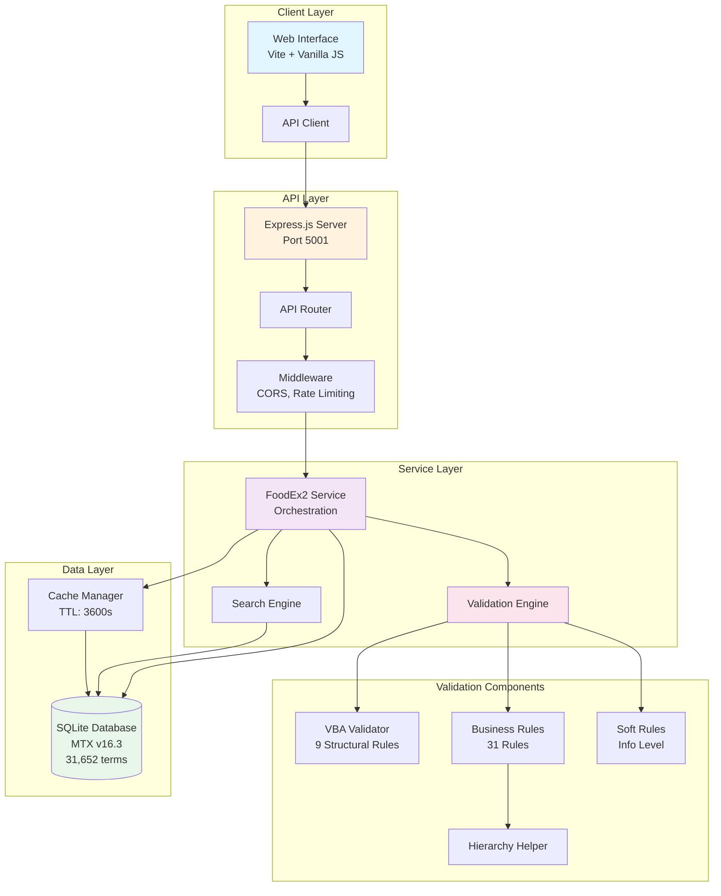

### Technology Stack

```
foodex2-validator/
├── server/                      # Backend application
│   ├── index.js                # Express server setup
│   ├── database-validator.js   # Database-driven validation orchestrator
│   ├── complete-business-rules.js  # All 31 business rules implementation
│   ├── setup-complete-database.js  # Complete database setup with all tables
│   ├── setup-database.js       # Initial database setup
│   └── import-excel.js         # Excel to SQLite converter
├── client/                     # Frontend application
│   ├── src/
│   │   ├── main.js            # Application logic
│   │   └── style.css          # Styling
│   ├── index.html             # Entry point
│   └── vite.config.js         # Vite configuration
├── data/                       # Data files
│   ├── mtx.db                 # SQLite database (31,619 terms)
│   ├── BR_Data.csv            # Forbidden processes definitions
│   ├── warningMessages.txt    # Business rule messages
│   └── warningColors.txt      # UI warning colors
└── Shell scripts              # Automation scripts
    ├── setup.sh               # One-time setup
    ├── start.sh               # Start both servers
    ├── start-backend.sh       # Start backend only
    └── start-frontend.sh      # Start frontend only
```

## Data Flow

### Validation Flow Diagram

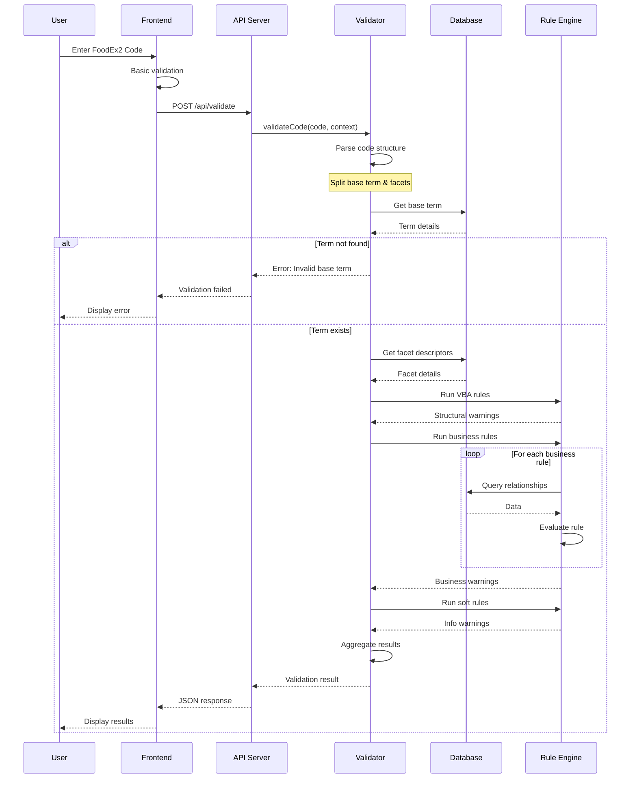

### Code Structure Diagram

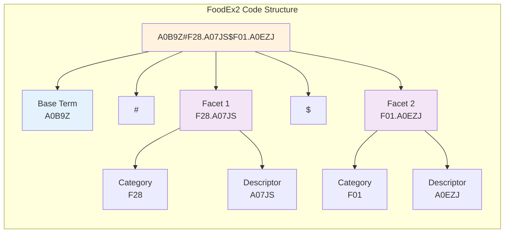

## Implementation Details

### Database Schema

#### Entity Relationship Diagram

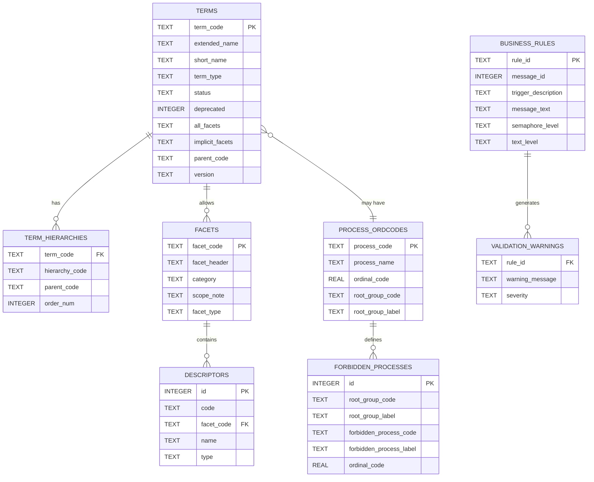

The SQLite database (converted from MTX Excel) contains:

```sql
-- Main terms table (31,652 records)
CREATE TABLE terms (
    term_code TEXT PRIMARY KEY,      -- e.g., 'A0B9Z'
    extended_name TEXT,              -- e.g., 'Bovine meat'
    short_name TEXT,
    term_type TEXT,                  -- r=raw, d=derivative, c=composite, etc.
    status TEXT,                     -- APPROVED, DISMISSED, etc.
    deprecated INTEGER DEFAULT 0,
    all_facets TEXT,                -- Allowed facets
    implicit_facets TEXT,           -- Inherited facets
    -- ... additional fields
);

-- Term hierarchy relationships (88,642 records)
CREATE TABLE term_hierarchies (
    term_code TEXT,
    hierarchy_code TEXT,             -- expo, report, master, etc.
    parent_code TEXT,
    order_num INTEGER,
    PRIMARY KEY (term_code, hierarchy_code)
);

-- Process ordinal codes (80 records)
CREATE TABLE process_ordcodes (
    process_code TEXT PRIMARY KEY,
    process_name TEXT,
    ordinal_code REAL NOT NULL,
    root_group_code TEXT,
    root_group_label TEXT
);

-- Forbidden processes (423 records)
CREATE TABLE forbidden_processes (
    id INTEGER PRIMARY KEY,
    root_group_code TEXT NOT NULL,
    root_group_label TEXT,
    forbidden_process_code TEXT NOT NULL,
    forbidden_process_label TEXT,
    ordinal_code REAL
);

-- Business rules (31 records)
CREATE TABLE business_rules (
    rule_id TEXT PRIMARY KEY,
    message_id INTEGER,
    trigger_description TEXT,
    message_text TEXT,
    semaphore_level TEXT,
    text_level TEXT
);
```

### Code Structure

A FoodEx2 code consists of:
- **Base Term**: Primary food item (e.g., `A0B9Z`)
- **Facets**: Additional descriptors (e.g., `F28.A07JS`)
- **Format**: `BASETERM#FACET1#FACET2$FACET3`

### Validation Process

#### Validation State Machine

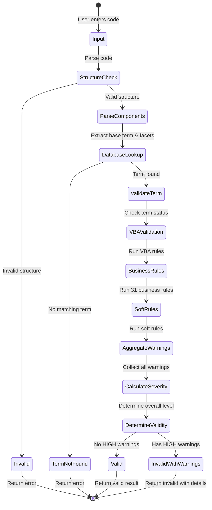

```javascript
async validate(code) {
    // 1. Structure validation (BR29)
    if (!isValidStructure(code)) return ERROR;
    
    // 2. Parse components
    const { baseTerm, facets } = parseCode(code);
    
    // 3. Database lookup
    const term = await getTerm(baseTerm);
    if (!term) return ERROR;
    
    // 4. Run all business rules
    await checkAllBusinessRules(term, facets, warnings);
    
    // 5. Calculate overall severity
    const overallLevel = calculateOverallLevel(warnings);
    
    return { code, warnings, overallLevel };
}
```

### Business Rules Engine

The complete business rules implementation (`complete-business-rules.js`) includes:

1. **Rule Organization**: Each rule is a separate async method
2. **Database Integration**: Queries for hierarchy relationships, ordinal codes
3. **Facet Parsing**: Handles both `#` and `$` separators
4. **Warning Generation**: Consistent warning format with severity levels

### Key Algorithms

#### Hierarchy Traversal Algorithm

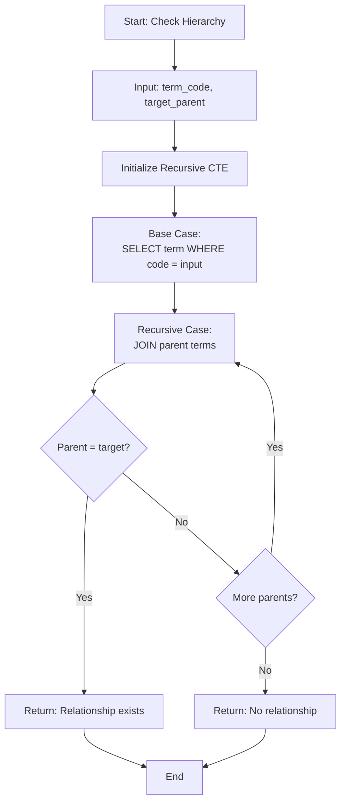

**Hierarchy Traversal** (for BR01, BR05, etc.):
```sql
-- Recursive CTE to check parent-child relationships
WITH RECURSIVE ancestors AS (
    SELECT term_code, parent_code FROM term_hierarchies WHERE term_code = ?
    UNION ALL
    SELECT th.term_code, th.parent_code 
    FROM term_hierarchies th
    JOIN ancestors a ON th.term_code = a.parent_code
)
SELECT 1 FROM ancestors WHERE parent_code = ?
```

#### Ordinal Code Processing Flow

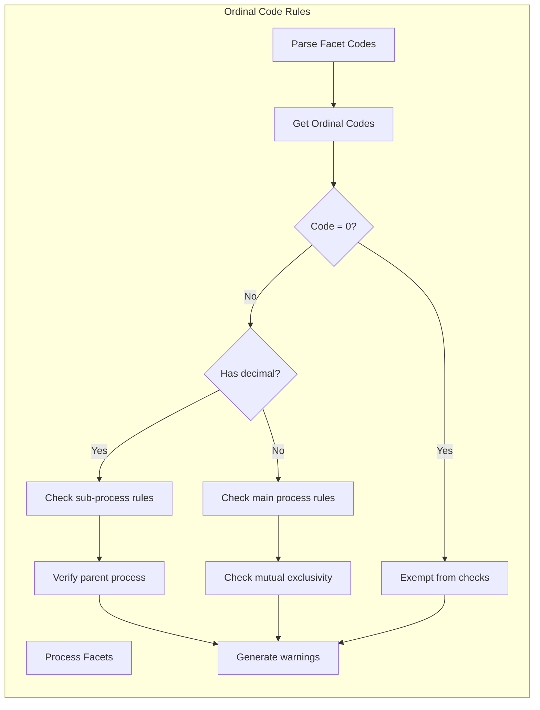

**Ordinal Code Checking** (for BR26, BR27):
- Processes with same ordinal code are mutually exclusive
- Decimal codes (1.1, 1.2) indicate sub-processes
- Code 0 is exempt from mutual exclusivity

## Deployment

### Development Setup

1. **Prerequisites**: Node.js 14+, npm
2. **Installation**: `./setup.sh`
3. **Database Setup**: `node server/setup-complete-database.js` (imports all validation data)
4. **Development**: `./start.sh` (includes hot reload)

### Production Deployment

1. **Build Frontend**: `cd client && npm run build`
2. **Environment Variables**:
   ```bash
   PORT=5001
   NODE_ENV=production
   ```
3. **Process Manager**: Use PM2 or similar for production

### API Integration

The validator exposes REST endpoints:

```javascript
// Single validation
POST /api/validate
{
    "code": "A0B9Z#F28.A07JS"
}

// Batch validation
POST /api/validate/batch
{
    "codes": ["A0B9Z", "A0EZS#F01.A0F6E", "A0BXM"]
}

// Response format
{
    "code": "A0B9Z#F28.A07JS",
    "valid": true,
    "baseTerm": {
        "code": "A0B9Z",
        "name": "Bovine meat",
        "type": "r"
    },
    "facets": ["F28.A07JS"],
    "warnings": [{
        "rule": "BR19",
        "message": "Processes that create...",
        "semaphoreLevel": "HIGH",
        "textLevel": "HIGH"
    }],
    "overallLevel": "HIGH",
    "processingTime": 45
}
```

## Performance Considerations

- **Database Indexes**: On term_code, hierarchy_code, process codes for fast lookups
- **No Runtime CSV Loading**: All validation data pre-loaded in database
- **Batch Processing**: Parallel validation for multiple codes
- **Connection Pooling**: Single SQLite connection reused
- **Query Optimization**: Direct SQL queries for all lookups

## Maintenance

### Adding New Business Rules

1. Add rule definition to `warningMessages.txt`
2. Implement method in `complete-business-rules.js`
3. Add call in validator's rule execution sequence
4. Test with known validation cases

### Updating MTX Catalogue

1. Export new MTX Excel to same format
2. Run Python import script or Node.js importer
3. Update CSV files if business rules change
4. Run `node server/setup-complete-database.js` to reimport all data
5. Restart server

### Monitoring

- Health check: `GET /api/health`
- Rule definitions: `GET /api/rules`
- Logs: Uses console logging (can be configured for production)

## Additional Diagrams

### Business Rule Categories

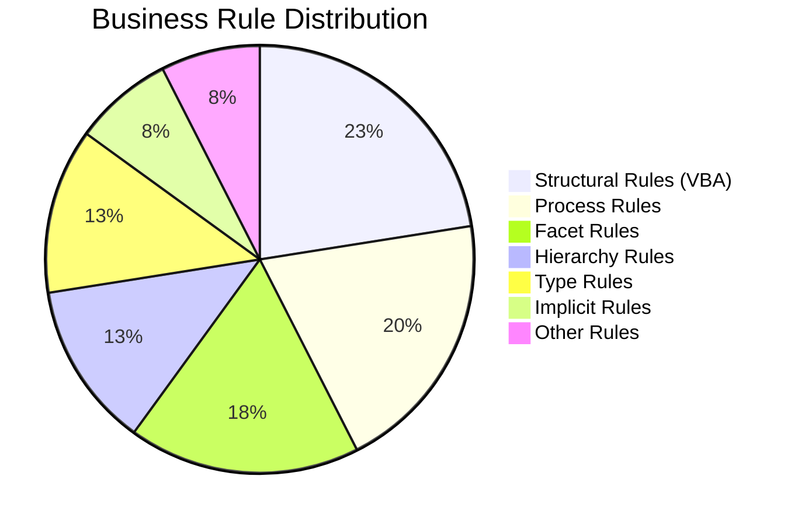

### API Request/Response Flow

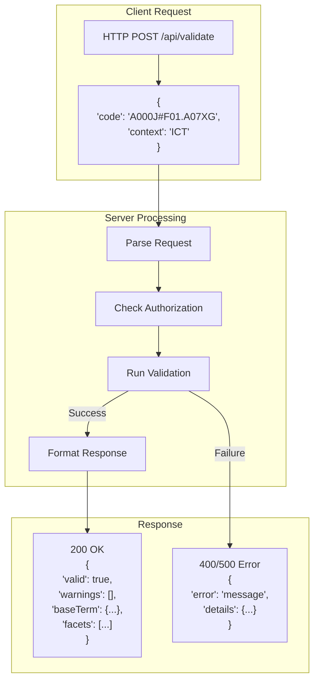

### Performance Optimization Strategy

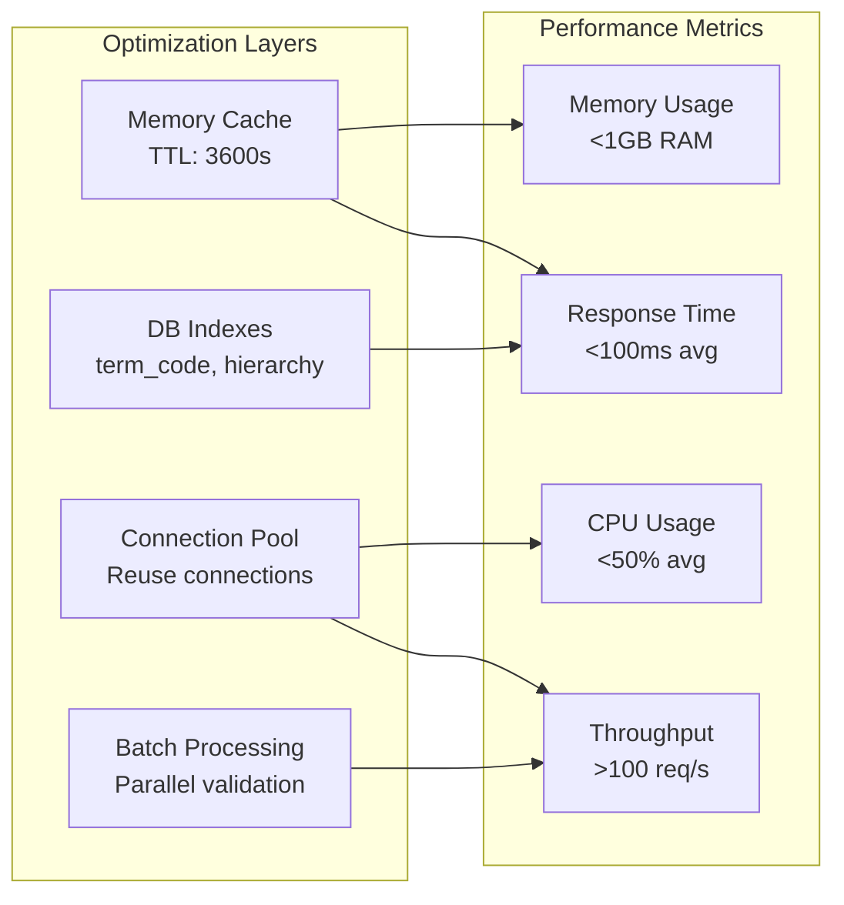

### Deployment Architecture

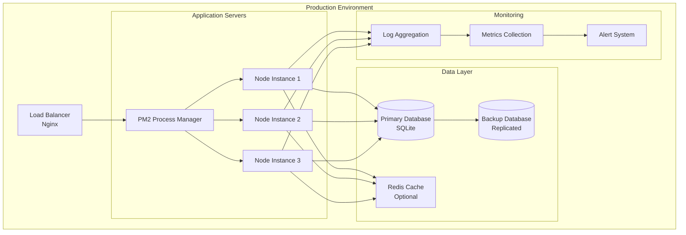

## Quick Reference

### Common FoodEx2 Codes

| Code Type | Example | Description |
|-----------|---------|-------------|
| Base Term Only | `A000J` | Simple food item |
| Single Facet | `A000J#F01.A07XG` | Food with one descriptor |
| Multiple Facets | `A000J#F01.A07XG$F28.A0EZJ` | Multiple descriptors |
| Complex | `A0B9Z#F01.A0F6E$F28.A07JS$F10.A0C7L` | Full classification |

### Severity Levels

| Level | Color | Blocking | Description |
|-------|-------|----------|-------------|
| HIGH | Red | Yes | Critical validation failure |
| MEDIUM | Orange | No | Important warning |
| LOW | Yellow | No | Minor issue |
| INFO | Blue | No | Informational message |

### API Endpoints Summary

| Method | Endpoint | Purpose |
|--------|----------|---------|
| POST | `/api/validate` | Single code validation |
| POST | `/api/validate/batch` | Multiple codes validation |
| POST | `/api/validate/export` | Export validation results |
| GET | `/api/search` | Search terms |
| GET | `/api/term/:code` | Get term details |
| GET | `/api/health` | Health check |
| GET | `/api/rules` | List all rules |
| GET | `/api/database/info` | Database statistics |